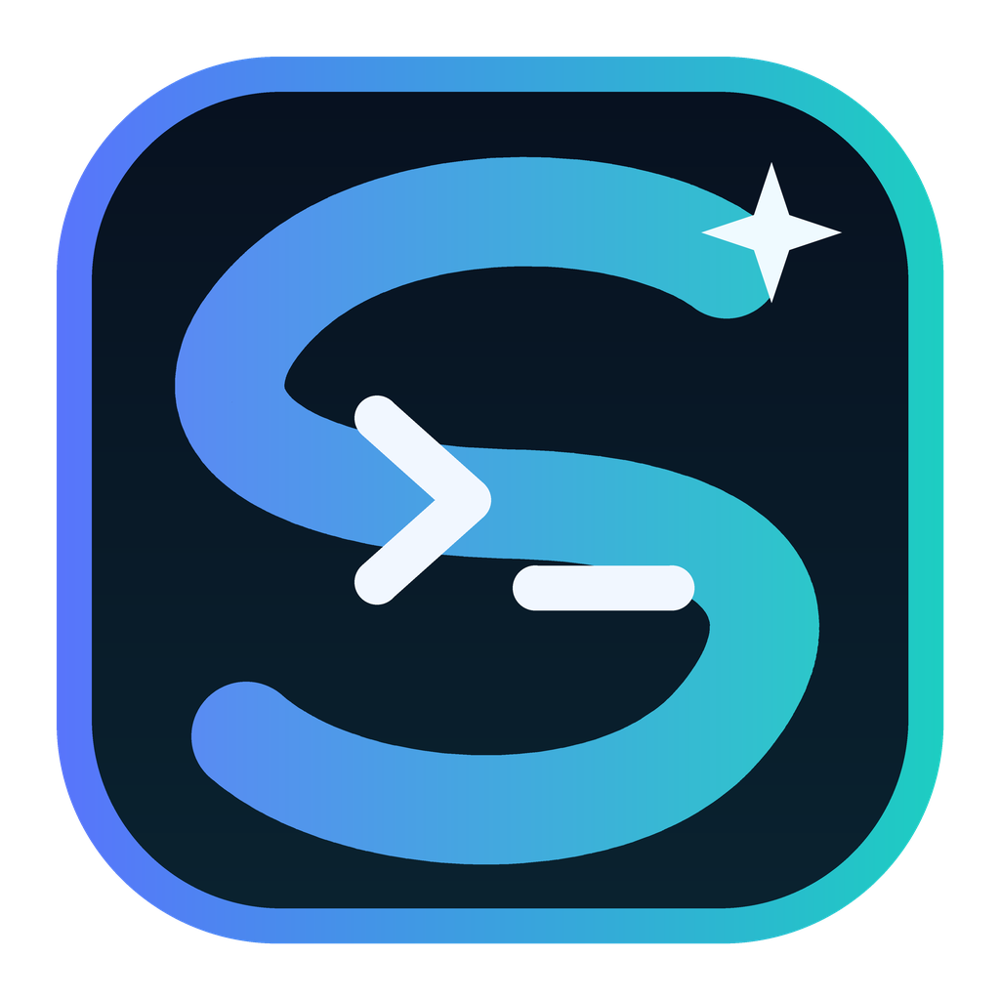

# Starline DSH Desktop

<p align="center">
  
</p>

[](https://github.com/FreeCodeCampXYG/starline-dsh-desktop/actions/workflows/ci.yml)
[](https://github.com/FreeCodeCampXYG/starline-dsh-desktop/actions/workflows/release.yml)
[](LICENSE)

Starline DSH Desktop 是 [DeepSeek Harness](https://github.com/deepseek-ai/deepseek-harness) 的轻量跨平台桌面宿主。它负责启动官方 `dsh web`、等待服务就绪，并在系统 WebView 中承载官方页面；不 fork DSH，不复制 Agent、会话、插件或模型调用逻辑。

> 本项目是独立社区项目，与 DeepSeek 官方无隶属、背书或商业关系。DSH 仍处于开发者预览阶段，上游版本可能发生破坏性变化。

> **v0.2.4 平台提示：** Windows x64 `offline-full` 已完成真实 PTY 抽查；macOS `offline-full` 存在 `spawn-helper` 权限缺陷，Linux `offline-full` 缺少可加载的 `node-pty` 原生绑定。需要终端、Shell 或 Bash 工具的 macOS/Linux 用户应暂用普通包。详情和未完成的设备验证见 [已知问题与平台支持边界](docs/KNOWN_ISSUES.md)。

> 当前 `main`（v0.3.1）已修复 macOS/Linux 原生构建兼容性，并加入白名单原生依赖准备、六平台真实 PTY 测试、最终归档复测和平台化托盘生命周期管理；这些改动不会反向改变旧版本资产，请以对应版本 Release 的矩阵结果为准。

## 功能

- Windows、macOS、Linux 原生桌面窗口；
- 固定 DSH 版本启动，避免 `latest` 漂移；
- 自动选择 loopback 端口并校验 DSH 页面指纹；
- 代理可视化：继承环境、自定义 HTTP(S) 代理、禁用代理；
- 本地 DSH 健康检查强制直连，不受外部代理影响；
- 启动诊断、日志目录、浏览器打开和一键重启；
- 启动页与运行状态栏显示桌面端版本和 DSH 版本；
- Windows 窗口右上角 X 隐藏到系统托盘，从托盘菜单选择“退出”才回收本应用创建的 DSH 进程树；macOS/Linux 暂按系统原生关闭行为退出，避免无托盘入口时进程残留；
- 支持多开 DSH Web 实例；配置保存带跨进程原子锁和过期版本检查，避免多开时静默覆盖代理设置；
- Windows Setup.exe 与便携 ZIP；macOS ZIP；Linux TAR.GZ；
- x64 与 ARM64 原生 GitHub Actions 构建。

## 截图中的两层界面

窗口顶部很窄的一条是 Starline 的宿主栏，提供“桌面工具”菜单；下面的大区域是官方 DSH Web UI。宿主不会重做 DSH 的工作区、会话、轨迹、插件和模型设置。

```text
Starline DSH Desktop (Go + Wails)
├─ 启动、错误、代理、帮助和日志界面
├─ 官方 DSH Web UI（iframe，仅加载 loopback）
└─ @deepseek-ai/dsh 子进程
   └─ dsh web --host 127.0.0.1 --port <动态端口>
```

详细边界见 [架构说明](docs/ARCHITECTURE.md)，全部维护资料从 [文档导航](docs/README.md) 进入。

## 系统要求

| 项目 | 要求 |
| --- | --- |
| Node.js | 普通包需要 `22.19+` 或 `24+`；`offline-full` 已内置固定 Node 24 |
| npm / npx | 普通包需要；`offline-full` 启动时不使用 npm/npx |
| Windows | Windows 10/11，WebView2 Runtime |
| macOS | Intel 或 Apple Silicon，使用系统 WebKit |
| Linux | GTK3、WebKitGTK 4.1 及其运行库；普通包首次安装原生依赖时还可能需要 Python 3、make 和 C/C++ 编译器 |
| 网络 | 普通包首次运行需要 npm registry；`offline-full` 不访问 npm，但模型服务等功能可能仍需网络 |

当前默认启动 `@deepseek-ai/dsh@0.1.0-rc.6`。可用 `DSH_DESKTOP_DSH_VERSION` 临时覆盖，但正式 Release 仍以仓库固定版本为准。

多开说明：每个桌面进程都会为 DSH 申请独立的动态 loopback 端口，因此可以同时打开多个 Web 实例。代理配置仍位于用户级共享配置文件；当另一个实例已经保存过新配置时，旧实例会收到冲突提示并拒绝覆盖，需要重新打开设置后再保存。不同实例如需完全隔离，应使用不同工作区。

## 安装与运行

发行文件统一使用 `<产品>-v<版本>-<系统>-<CPU>-<形态>-<联网模式>.<扩展名>`：

- `x64` 适用于常见 Intel/AMD 电脑，`arm64` 只用于 ARM 设备；macOS 进一步写明 `intel-x64` 或 `apple-silicon-arm64`；
- `setup` 是 Windows 安装向导，`portable` 是解压即用的便携包，`app` 是 macOS 应用包；
- `online` 是体积较小的普通包，需要系统 Node.js/npx，首次启动可能访问 npm registry；
- `offline-full` 内置固定 Node.js 与 DSH 生产依赖，文件明显更大，但启动 DSH 时不访问 npm。

Release 页面会按平台分组并显示每个文件的实际体积，不需要再根据文件大小猜测包类型。

### Windows

- `starline-dsh-desktop-v0.3.1-windows-x64-setup-online.exe`：常规 x64 在线小包，默认安装到当前用户目录；安装向导可选择其他本地可写目录；
- `starline-dsh-desktop-v0.3.1-windows-x64-portable-online.zip`：x64 在线便携版，解压后运行；
- `starline-dsh-desktop-v0.3.1-windows-x64-portable-offline-full.zip`：内含 Node 与固定 DSH 依赖的 x64 完整离线便携版；
- Windows on ARM 设备选择文件名含 `windows-arm64` 的对应产物，不要下载 x64 包。

安装包未签名时，SmartScreen 可能提示未知发布者。正式广泛分发前需要代码签名证书。

安装器使用 Unicode NSIS，并对目录中的中文、空格进行自动化安装/升级/卸载测试。应用不依赖固定安装路径：普通安装版从系统 PATH 查找 Node；`offline-full` 始终从桌面可执行文件旁定位 `offline-runtime/`。安装器会把用户选择的目录记录为 `InstallLocation`，再次安装或升级时继续使用该目录。由于 Setup 是当前用户权限，选择 `Program Files` 等需要管理员权限的位置会失败；建议选择当前用户有写权限的本地目录。UNC 网络路径和超长路径尚未完成设备验证，不作为当前支持承诺。

### macOS

Intel Mac 下载文件名含 `macos-intel-x64-app` 的 ZIP；M1/M2/M3/M4 等 Apple Silicon Mac 下载文件名含 `macos-apple-silicon-arm64-app` 的 ZIP。根据是否需要内置 Node/DSH 选择 `online` 或 `offline-full`，解压后将应用移动到 Applications。当前构建未进行 Developer ID 签名和 notarization，Gatekeeper 可能阻止首次打开。

v0.2.4 的 macOS `offline-full` 包不支持依赖 PTY 的终端/Shell 工具：ARM64 正式归档已确认 `spawn-helper` 缺少可执行位，Intel 包因相同打包逻辑也按受影响处理。需要这些能力时请使用普通包；同时要求完全离线和 PTY 时请等待修复版本。

### Linux

常见 Intel/AMD 电脑下载 `linux-x64`，ARM 设备下载 `linux-arm64`。在线小包示例：

```bash
tar -xzf starline-dsh-desktop-v0.3.1-linux-x64-portable-online.tar.gz
chmod +x starline-dsh-desktop
./starline-dsh-desktop
```

离线机器可以选择同架构、文件名以 `portable-offline-full.tar.gz` 结尾的完整离线包，目录结构和启动命令相同，但会多出 `offline-runtime/`。v0.2.4 的 Linux x64 正式归档已确认缺少可加载的 `node-pty` 原生绑定，ARM64 因相同打包逻辑也按受影响处理；依赖终端/PTY 的功能不可用。

`offline-full` 是独立可选产物，不会放进普通 Setup 或便携包。Windows x64 v0.2.4 参考值：普通 ZIP 约 4.3 MiB、Setup 约 6.0 MiB、完整离线 ZIP 约 113.6 MiB；完整离线包解压后超过 350 MiB，并包含数万个文件。各平台的准确体积以 Release 资产为准。

不同发行版的 WebKitGTK 包名不同。Ubuntu 24.04 可安装：

```bash
sudo apt-get install libgtk-3-0 libwebkit2gtk-4.1-0
```

## 第一次启动

1. 应用优先检查可执行文件旁的完整 `offline-runtime/`；
2. 存在匹配离线运行时就直接启动包内 Node/DSH；否则检查系统 Node.js 和 `npx`，优先复用 npm 内容缓存，缓存缺失时第一次下载可能需要数分钟；
3. DSH 启动在随机的 `127.0.0.1` 高位端口；
4. 原生窗口先短暂隐藏预热；宿主确认 HTTP 200 和 `<title>DeepSeek Harness</title>` 后在遮罩后加载 iframe，并以淡入方式显示官方页面；
5. 第一次选择工作区是 DSH 自身的正常初始化；
6. 模型、插件和工作区权限继续在官方 DSH 页面中设置。

预热最多等待 800 毫秒：DSH 很快就绪时直接显示已加载页面；较慢时会先显示稳定的“后台准备”界面，不会让窗口一直隐藏。启动失败或 DSH 意外退出时，错误摘要会固定显示在顶部，并提供详情、重试、代理设置和日志入口。

普通包不会直接调用 PATH 中版本未知的全局 `dsh`，而是要求桌面端选定的固定版本（当前默认 `@deepseek-ai/dsh@0.1.0-rc.6`）。npx 会优先复用与该版本对应的 npm 缓存，因此日常重复启动不会重复下载完整包；缓存不存在或已被清理时才需要联网获取。

Windows 窗口右上角 X 的行为是隐藏到系统托盘，因此 DSH/Node 会继续运行，方便从托盘快速恢复窗口。需要释放端口、文件句柄和子进程时，请右击托盘图标并选择“退出”；宿主只回收自己创建的 DSH/Node 进程树，不扫描或终止其他 DSH 实例。macOS/Linux 当前使用系统原生关闭行为直接退出，托盘能力待后续采用与 Wails 原生菜单兼容的实现。

## 代理设置

打开右上角 **桌面工具 → 代理与启动设置**：

| 模式 | 行为 | 适用场景 |
| --- | --- | --- |
| 继承系统环境 | 保留启动应用时的 `HTTP_PROXY` / `HTTPS_PROXY` 等变量 | 已在系统或启动脚本配置代理 |
| 自定义代理 | 覆盖 DSH/npm 子进程代理 | VPN 客户端只开放本机 HTTP 端口 |
| 禁用代理 | 移除继承的代理变量 | 网络可直连，或继承到错误代理 |

自定义地址支持 `http://` 与 `https://`。直接填写 `127.0.0.1:10808` 时会规范化为 `http://127.0.0.1:10808`。保存后 DSH 自动重启。

所有模式都会把 `127.0.0.1,localhost,::1` 合并进 `NO_PROXY`，本地 WebView 与 DSH 健康检查不会绕到外部代理。配置保存在用户配置目录下的 `starline-dsh-desktop/settings.json`，不保存模型密钥。

## 下载校验

每个产物旁都有 `.sha256`，Release 还包含合并的 `SHA256SUMS.txt`。

Windows：

```powershell
Get-FileHash .\starline-dsh-desktop-v0.3.1-windows-x64-setup-online.exe -Algorithm SHA256
```

macOS/Linux：

```bash
sha256sum -c starline-dsh-desktop-v0.3.1-linux-x64-portable-online.tar.gz.sha256
```

## 常见问题

### 为什么不直接把 DSH UI 重写成 Go？

DSH 已有完整 Web UI。复制会话、SSE、工具审批和插件 UI 会产生第二套客户端，并使上游升级成本急剧增加。本项目刻意保持窄边界。

### 为什么普通包仍需要 Node.js？

Node 是 DSH 的运行时。普通 Setup/ZIP 为了保持小体积，继续使用系统 Node 与 npx；可选的 `offline-full` 则重新分发固定 Node 可执行文件和锁定的 DSH 生产依赖。离线包免除 npm 下载，但不会让模型 provider、远程 MCP、Web 工具或更新功能自动离线。

### 启动后让我选择工作区正常吗？

正常。这是官方 DSH 的首次初始化；Starline 不创建或接管 DSH 工作区。

### 关闭时出现黑框怎么办？

当前 Windows 版本使用无控制台窗口启动 Node/DSH。窗口 X 会隐藏到托盘而不是结束进程；要释放资源请使用托盘“退出”。如果选择托盘退出后仍闪黑框，请提交 Bug，并附系统版本、安装方式和脱敏日志。

### 页面功能异常应该在哪里反馈？

- 启动、代理、窗口、日志、安装包和进程回收：本仓库；
- Agent、模型、会话、插件、轨迹或浏览器直接运行也存在的 UI 问题：[deepseek-harness](https://github.com/deepseek-ai/deepseek-harness/issues)。

### 为什么正式安装包打不开 DevTools？

正式 Release 不携带 Wails DevTools，这是预期的生产安全边界，不是代理或 DSH 页面故障。源码调试时运行 `wails dev`；DevTools 默认不弹窗，Windows/Linux 按 `Ctrl+Shift+F12`、macOS 按 `Fn+Command+Shift+F12` 手动打开。需要调试独立可执行文件时使用 `wails build -debug`。具体命令见 [开发与跨平台构建](docs/BUILDING.md#本地开发与-devtools)。

### 修复终端后，Agent 就能无限制操作电脑吗？

不能。`node-pty` 只是让 DSH 的终端/Shell 通道能够正常工作，不会授予管理员、UAC 或 root 权限，也不会绕过 DSH 自身的工具审批和工作区策略。桌面宿主不提权、不关闭系统安全机制，并以启动它的当前用户身份运行；文件、命令和其他工具最终仍受 DSH 当前模式、所选工作区、系统文件权限和安全软件约束。

更多排错步骤见 [故障排查](docs/TROUBLESHOOTING.md)。

## 开发、构建与发布

- [文档导航](docs/README.md)
- [已知问题与平台支持边界](docs/KNOWN_ISSUES.md)
- [开发与跨平台构建](docs/BUILDING.md)
- [架构与安全边界](docs/ARCHITECTURE.md)
- [品牌与应用图标](docs/BRANDING.md)
- [发布流程](docs/RELEASING.md)
- [开源工程参考](docs/OPEN_SOURCE_REFERENCES.md)
- [贡献指南](CONTRIBUTING.md)
- [变更日志](CHANGELOG.md)
- [安全策略](SECURITY.md)
- [版权与第三方许可说明](NOTICE.md)
- [作者与维护者](AUTHORS.md)

## 路线图

1. 外部 Node + 固定 DSH 版本的可靠跨平台桌面壳；
2. 工作目录和 DSH 版本可视化配置；
3. v0.3.0 评估把数万个离线依赖文件封装为单一 tarball，启动时校验 SHA-256 后原子解压，并补齐完整第三方许可证清单；
4. Windows 代码签名、macOS Developer ID/notarization 与更新通道。

路线图不承诺重写 DSH Agent、会话系统或插件内核。

## 作者与维护

- 作者与主要维护者：[starline](https://github.com/FreeCodeCampXYG)
- 联系邮箱：[1308947723@qq.com](mailto:1308947723@qq.com)
- 贡献记录：[GitHub Contributors](https://github.com/FreeCodeCampXYG/starline-dsh-desktop/graphs/contributors)

作者职责、贡献者版权和第三方作者边界见 [AUTHORS.md](AUTHORS.md)。

## 许可证

```text
Copyright (c) 2026 starline and contributors
```

本项目自有代码、构建脚本、项目自有前端和配套文档使用 [MIT License](LICENSE)。你可以使用、修改、分发、再许可和商业使用，但在软件副本或实质性部分中必须保留原版权声明与 MIT 许可声明。MIT 是版权许可，不是版权转让：starline 与贡献者仍保留各自作品的版权；软件按“原样”提供，不附带担保。

DeepSeek Harness、Node.js、Wails、WebView/WebKit、GTK 及其他第三方依赖保留各自版权，并遵循各自许可证。`offline-full` 会保留包内随第三方组件分发的许可文件，但依赖锁文件不等于完整的法律清单。详细边界、贡献版权和商标说明见 [版权与第三方许可说明](NOTICE.md)。所有安装包和便携压缩包都会携带本项目的许可证、NOTICE 与作者信息，具体位置见 [发布流程](docs/RELEASING.md)。
